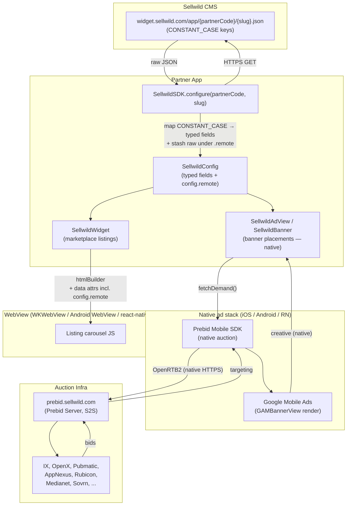
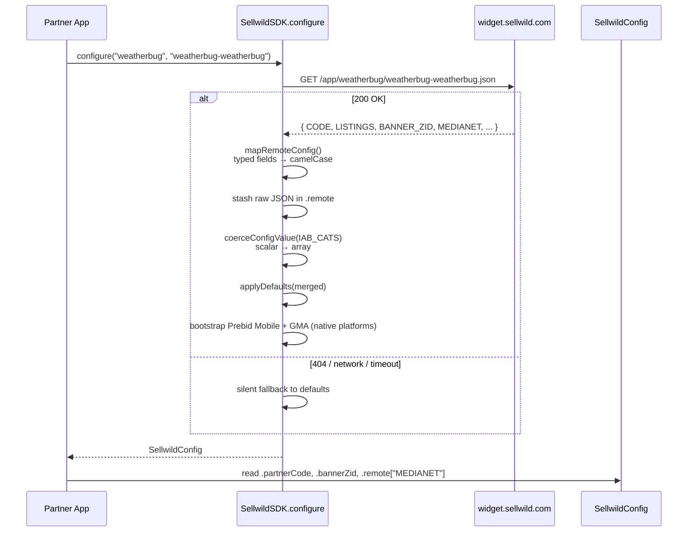
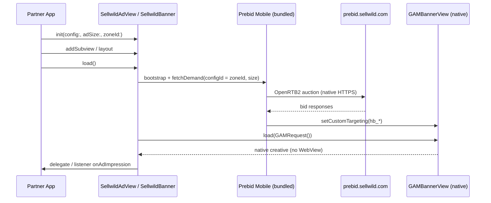
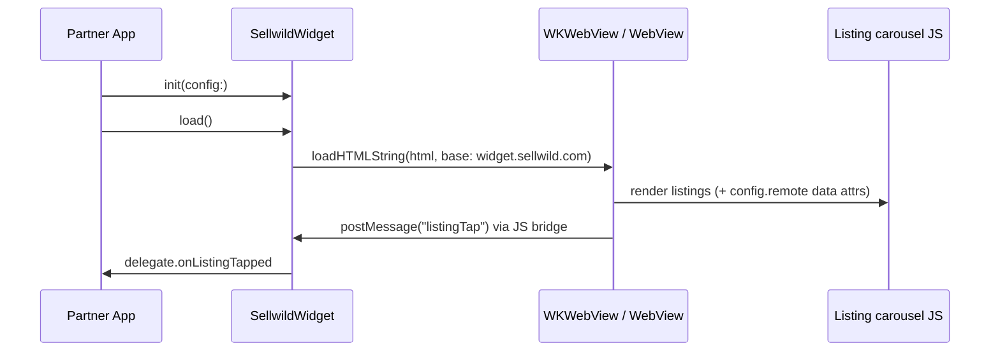
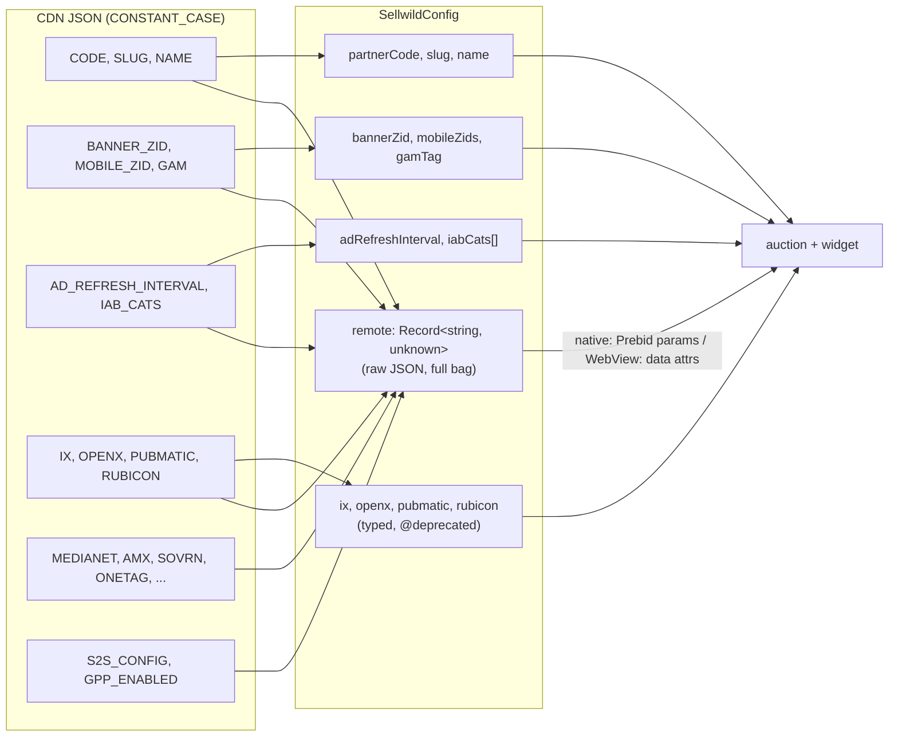

# Sellwild SDK Architecture

A grounded, current-as-of-1.7.0 picture of what the SDK actually is, how data flows through it, and which parts are native vs. WebView. No aspirational diagrams.

---

## TL;DR

- **Config** is fetched from a CDN as JSON. Identical flow on every platform.
- **Ad rendering is native** on iOS, Android, and React Native: `SellwildAdView` / `SellwildBanner` runs a **Prebid Mobile** auction and renders through **Google Mobile Ads** (GAM). There is **no WebView in the ad path** on those platforms.
- **Flutter** still renders ads through a WebView (Prebid.js in `webview_flutter`) — the legacy track, kept for parity until the native Flutter view lands.
- **The marketplace widget** surface (`SellwildWidget` / `SellwildWidgetView`) renders *listings* in a WebView on every platform. That surface is intentionally a WebView; the banner/ad units above it are not.
- **`config.remote`** is a passthrough bag of the raw CDN JSON. It exists so new bidders / new fields the CMS adds reach the auction (native serializer + WebView passthrough) without an SDK release.

---

## High-level flow

> The `.prebidOnly` ad stack (see below) skips GAM entirely and renders through Prebid Mobile's own `BannerView`. Flutter renders the banner through a WebView instead of the native stack.

---

## Step-by-step: what `configure()` actually does

**Key invariants**
- `configure(partnerCode, slug)` never throws. Network failure → defaults.
- `config.remote` always populated when fetch succeeds; contains *every* CDN key including ones the SDK doesn't have a typed field for.
- All five platforms (TS core, RN, iOS, Android, Flutter) have their own `configure()` with the same shape.
- On the native platforms, `configure()` also bootstraps Prebid Mobile + the Google Mobile Ads SDK (idempotent) so the first ad load doesn't race an uninitialized auction.

---

## Ad rendering: the native path (default)

This is what runs when a partner drops a `SellwildAdView` (iOS/Android) or `SellwildBanner` (RN) into their app and calls `load()`. No opt-in, no extra dependency wiring — Prebid Mobile is bundled and the view drives the auction itself.

**Ad stacks** — resolved per placement from `AD_STACK` / `AD_STACK_BY_ZONE`:

| Stack | Behavior |
|---|---|
| `.both` (default) | Prebid Mobile auction → GAM renders the winner. Manual refresh (capped + floored). |
| `.gamOnly` | Plain GAM request, no Prebid auction. |
| `.prebidOnly` | Prebid Mobile's own rendering `BannerView`, **no GAM request** (no GAM serving fees). Auto-refresh is internal to Prebid, floored + capped by the SDK. |

**What lives where**
| Layer | iOS | Android | RN | Flutter |
|---|---|---|---|---|
| Native ad view | `SellwildAdView: UIView` | `SellwildAdView: FrameLayout` | `SellwildBanner` (native view) | *(WebView — legacy)* |
| Auction + render | Prebid Mobile → GMA | Prebid Mobile → GMA | bridges the native view | Prebid.js in `webview_flutter` |
| Click/impression | delegate | listener | RN bridge | platform channel |

Implementation:
- iOS: `ios/Sources/SellwildSDK/SellwildAdView.swift` + `SellwildPrebidMobile.swift`
- Android: `android/src/main/kotlin/com/sellwild/sdk/SellwildAdView.kt` + `SellwildPrebidMobile.kt`
- RN: `react-native/src/SellwildBanner.tsx` (`requireNativeComponent` — bridges the native iOS/Android view)

---

## Ad rendering: the WebView surfaces

Two things still legitimately use a WebView:

1. **The marketplace widget** (`SellwildWidget` / `SellwildWidgetView`) — renders the listing carousel from generated HTML on every platform. Clicks/impressions come back over the JS bridge (`WKScriptMessageHandler`, `@JavascriptInterface`, RN bridge, platform channel).
2. **Flutter banners** — `SellwildBanner` (Flutter) renders ads through `webview_flutter` with Prebid.js inside. This is the legacy ad track, retained until the native Flutter view ships.

---

## Config map: typed vs. passthrough

**Why both?**
- Typed fields exist for native code that *behaves* on values (e.g. `config.adRefreshInterval` drives the refresh timer / floor).
- `config.remote` exists so new bidders the CMS adds (Weatherbug has 15 unmapped today: MEDIANET, AMX, SOVRN, etc.) reach the auction — as Prebid Mobile params on native, and as WebView data attributes on the widget / Flutter — without an SDK release.
- Typed bidder fields (`ix`, `openx`, `pubmatic`, `appnexus`) are `@deprecated`. Read from `config.remote["IX"]` etc. going forward.

---

## Per-platform integration ceremony

```mermaid
flowchart TD
    subgraph RN["React Native"]
        RN1["import { configure, SellwildBanner }"]
        RN2["const config = await configure(partnerCode, slug)"]
        RN3["&lt;SellwildBanner config={config} adSize='300x250' /&gt;"]
        RN1 --> RN2 --> RN3
    end

    subgraph iOS["Swift"]
        iOS1["let config = await SellwildSDK.configure(partnerCode:, slug:)"]
        iOS2["let adView = SellwildAdView(config: config, adSize: .mrec, zoneId: '280')"]
        iOS3["view.addSubview(adView)"]
        iOS4["adView.load()  ← required, separate call"]
        iOS1 --> iOS2 --> iOS3 --> iOS4
    end

    subgraph Android["Kotlin"]
        AND1["val config = SellwildSDK.configure(partnerCode, slug)"]
        AND2["val adView = SellwildAdView(context)"]
        AND3["adView.setup(config, AdSize.MREC_300x250, zoneId = '280')"]
        AND4["adView.load()  ← required, separate call"]
        AND1 --> AND2 --> AND3 --> AND4
    end
```

**Friction (real, not aspirational)**
- iOS `load()` is separate from `init`. Easy to forget.
- Android requires three calls (`new`, `setup`, `load`). Should collapse.
- `zoneId` is a positional string; partners have to remember it lives in `config.bannerZid` or `config.mobileZids[0]`.

---

## What's published

| Platform | Package | Registry | Version | Status |
|---|---|---|---|---|
| TS core | `@sellwild/sdk-core` | npm | 1.7.0 | ✅ live |
| React Native | `@sellwild/react-native-sdk` | npm | 1.7.0 | ✅ live |
| iOS | `SellwildSDK` | CocoaPods + SPM | 1.7.0 | ✅ live |
| Android | `com.sellwild:sdk` | `s3://maven.sellwild.com/releases/` | 1.7.0 | ✅ live |
| Flutter | `sellwild_sdk` | pub.dev | 1.3.0 | ✅ live (WebView ad track) |

**Open follow-ups**
- Flutter still renders ads through a WebView; a native Flutter ad view would bring it to parity with iOS/Android/RN.
- iOS `load()` / Android three-call ceremony could collapse into the initializer.
