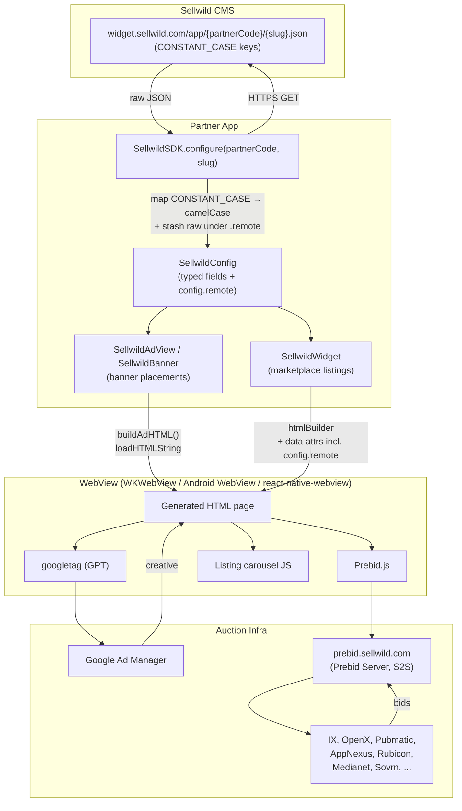
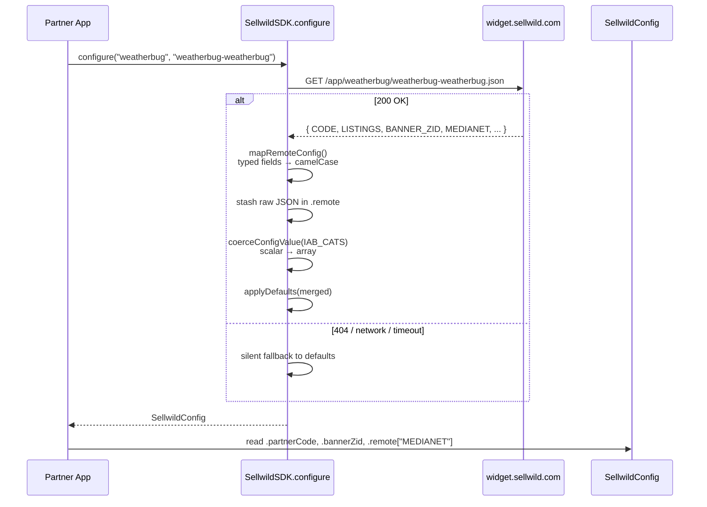
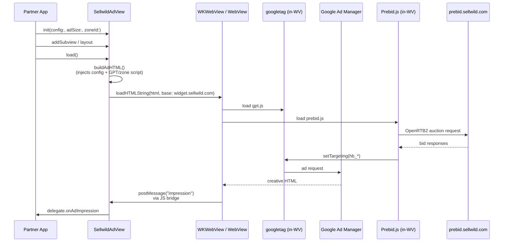
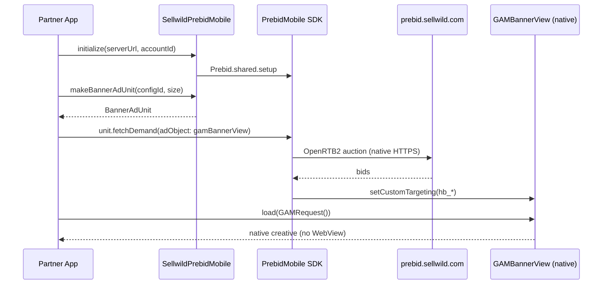
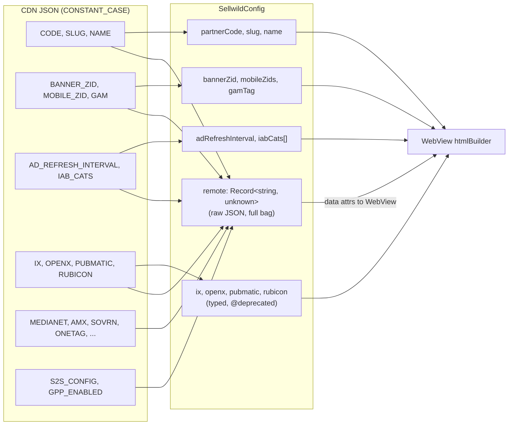

# Sellwild SDK Architecture

A grounded, current-as-of-1.2.0 picture of what the SDK actually is, how data flows through it, and which parts are native vs. WebView. No aspirational diagrams.

---

## TL;DR

- **Config** is fetched from a CDN as JSON. Identical flow on every platform.
- **Ad rendering** is WebView-based by default on every platform. GPT/Prebid.js runs *inside* the WebView.
- **Native Prebid Mobile** integration exists on iOS + Android as an *opt-in* bridge (`SellwildPrebidMobile`). Partners who want true-native auctions wire it up themselves and pair it with their own GAM ad view.
- **`config.remote`** is a passthrough bag of the raw CDN JSON. It exists so new bidders / new fields the CMS adds reach the WebView without an SDK release.

---

## High-level flow

---

## Step-by-step: what `configure()` actually does

**Key invariants**
- `configure(partnerCode, slug)` never throws. Network failure → defaults.
- `config.remote` always populated when fetch succeeds; contains *every* CDN key including ones the SDK doesn't have a typed field for.
- All five platforms (TS core, RN, iOS, Android, Flutter) have their own `configure()` with the same shape.

---

## Ad rendering: the WebView path (default)

This is what runs when a partner drops a `SellwildAdView` (iOS/Android) or `SellwildBanner` (RN) into their app without doing anything else.

**What lives where**
| Layer | iOS | Android | RN | Flutter |
|---|---|---|---|---|
| Native shell | `SellwildAdView: UIView` | `SellwildAdView: FrameLayout` | `SellwildBanner` (RN component) | `SellwildBannerView` |
| WebView | `WKWebView` | `android.webkit.WebView` | `react-native-webview` | `webview_flutter` |
| Auction JS | GPT + Prebid.js loaded *inside* WebView | same | same | same |
| Click/impression | `WKScriptMessageHandler` | `@JavascriptInterface` | RN bridge | platform channel |

---

## Ad rendering: the native Prebid path (opt-in)

Available today on iOS + Android via `SellwildPrebidMobile`. Partners who want true-native auctions opt in by adding the Prebid Mobile pod/dependency and pairing it with their own GAM `AdManagerAdView`.

**Status**
- iOS file: `ios/Sources/SellwildSDK/SellwildPrebidMobile.swift` (gated on `#if canImport(PrebidMobile)`)
- Android file: `android/src/main/kotlin/com/sellwild/sdk/SellwildPrebidMobile.kt.reference` — **note the `.reference` suffix.** Not currently part of the Android build. Needs to be promoted to `.kt` and the Prebid Mobile dependency declared `compileOnly` in `build.gradle.kts`.
- No automated wiring from `SellwildConfig` → Prebid Mobile params yet. Partners read `config.bannerZid`, `config.s2sConfig`, etc. and pass them into `SellwildPrebidMobile.initialize` themselves.

---

## Config map: typed vs. passthrough

**Why both?**
- Typed fields exist for native code that *behaves* on values (e.g. `config.adRefreshInterval` drives the iOS `Timer`).
- `config.remote` exists so new bidders the CMS adds (Weatherbug has 15 unmapped today: MEDIANET, AMX, SOVRN, etc.) reach the WebView's Prebid.js without an SDK release.
- Typed bidder fields (`ix`, `openx`, `pubmatic`, `appnexus`) are `@deprecated`. Read from `config.remote["IX"]` etc. going forward.

---

## Per-platform integration ceremony

```mermaid
flowchart TD
    subgraph RN["React Native"]
        RN1["import { configure, SellwildBanner }"]
        RN2["const config = await configure(partnerCode, slug)"]
        RN3["&lt;SellwildBanner config={config} adSize='300x250' /&gt;"]
        RN1 --> RN2 --> RN3
    end

    subgraph iOS["Swift"]
        iOS1["let config = await SellwildSDK.configure(partnerCode:, slug:)"]
        iOS2["let adView = SellwildAdView(config: config, adSize: .mrec, zoneId: '280')"]
        iOS3["view.addSubview(adView)"]
        iOS4["adView.load()  ← required, separate call"]
        iOS1 --> iOS2 --> iOS3 --> iOS4
    end

    subgraph Android["Kotlin"]
        AND1["val config = SellwildSDK.configure(partnerCode, slug)"]
        AND2["val adView = SellwildAdView(context)"]
        AND3["adView.setup(config, AdSize.MREC_300x250, zoneId = '280')"]
        AND4["adView.load()  ← required, separate call"]
        AND1 --> AND2 --> AND3 --> AND4
    end
```

**Friction (real, not aspirational)**
- iOS `load()` is separate from `init`. Easy to forget.
- Android requires three calls (`new`, `setup`, `load`). Should collapse.
- `zoneId` is a positional string; partners have to remember it lives in `config.bannerZid` or `config.mobileZids[0]`.

---

## What's published (1.2.0)

| Platform | Package | Registry | Status |
|---|---|---|---|
| TS core | `@sellwild/sdk-core` | npm | ✅ live |
| React Native | `@sellwild/react-native-sdk` | npm | ✅ live |
| iOS | `SellwildSDK` | CocoaPods + SPM | ✅ live |
| Android | `com.sellwild:sdk` | `s3://maven.sellwild.com/releases/` | ✅ live |
| Flutter | `sellwild_sdk` | pub.dev | ✅ live |

**Known issues blocking 1.2.1**
- `iabCats` scalar-vs-array crash in `htmlBuilder` (fix committed, not yet published).
- Sample apps lead with the WebView widget tab on iOS/Android instead of the banner integration partners actually need.
- Android `SellwildPrebidMobile.kt.reference` not yet promoted to a real source file.
